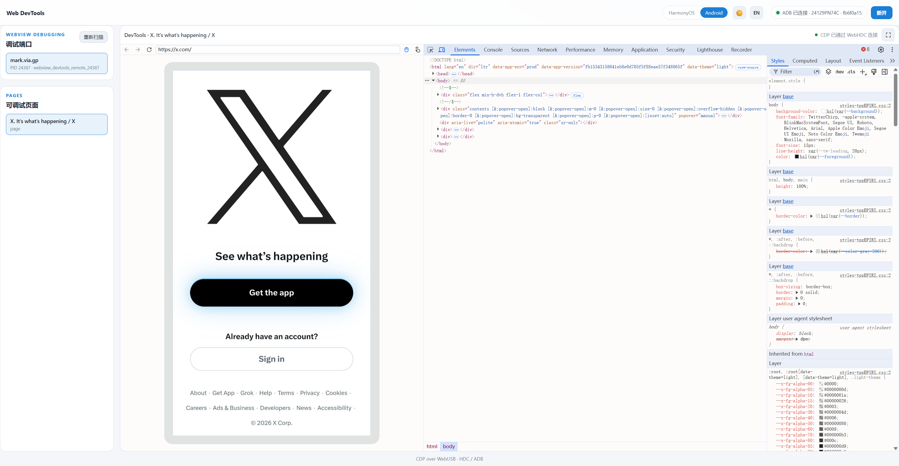

# Mobile Web DevTools

Debug WebViews on mobile devices directly from the browser over WebUSB — no local
`adb` / `hdc` server required.

**Live:** <https://webinspect.online> (desktop Chrome / Edge, with the
device plugged into the machine running the browser)

Supported platforms (auto-detected from the USB interface descriptors — the
device picker accepts both and no manual platform selection is needed):

- **HarmonyOS / OpenHarmony** — HDC protocol via [`@webhdc/core`](https://www.npmjs.com/package/@webhdc/core)
- **Android** — ADB over WebUSB via [`@yume-chan/adb`](https://www.npmjs.com/package/@yume-chan/adb) (RSA keys generated by WebCrypto and stored in IndexedDB)




## Features

- Discover WebView DevTools sockets by scanning `/proc/net/unix`, with automatic
  app package name resolution
- Map `localabstract:` DevTools sockets and read `/json/list` / `/json/version`
- Embed the matching Chromium DevTools frontend, bridged over USB via
  `MessageChannel` (works identically for both platforms)
- Automatic frontend fallback: device revision → pinned Chromium build →
  bundled local copy (see `pnpm run fetch:devtools`), so debugging still works
  where `chrome-devtools-frontend.appspot.com` is unreachable
- When the official frontend has not responded for 5 seconds, a dialog offers
  switching to the bundled copy manually; the choice applies to the rest of the
  session
- Sidebar listing debuggable ports and pages; DevTools fills the rest of the window
- Auto refresh: page list polled every 2s, ports rescanned in the background,
  automatic teardown on USB unplug
- Light / dark theme (follows the system, manually switchable)

## Getting Started

```bash
pnpm install
pnpm dev
```

Open `http://localhost:3000` in desktop Chrome or Edge. Stop any local
`adb` / `hdc` server first so the browser can claim the USB interface, and make
sure WebView debugging is enabled in your app.

The DevTools frontend itself is normally fetched from
`chrome-devtools-frontend.appspot.com` at runtime. That host is unreachable from
mainland China; run the one-time download below to install a bundled fallback
copy (served from the same origin, ~66 MB on disk, not committed to git):

```bash
pnpm run fetch:devtools
```

## Scripts

| Command | Description |
| --- | --- |
| `pnpm dev` | Start the dev server |
| `pnpm build` | Build for production |
| `pnpm preview` | Preview the production build |
| `pnpm typecheck` | Run TypeScript type checking |
| `pnpm test` | Run unit tests (vitest) |
| `pnpm check` | Lint and format with Biome |
| `pnpm fetch:devtools` | Download the bundled DevTools frontend fallback (via npmmirror) |
